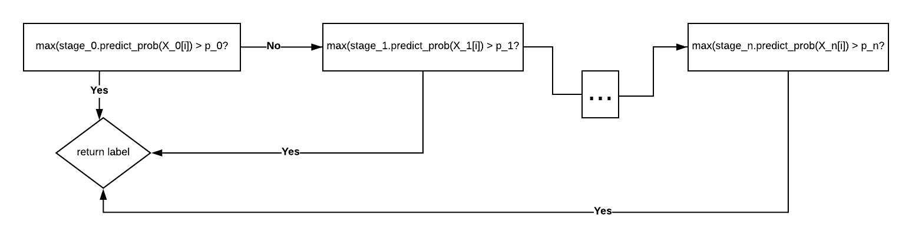

# MSCO: Multi-Stage Classification Optimization

MSCO is a project in development aiming to provide tools which help users construct and optimize  multi-stage classification schemes.

**Please see `docs` directory for example workflows, method comparisons, and more background info.**

More advanced methods involving genetic algorithms, which are outside the scope of this project, are also being developed with Errin Fulp (http://haminh16.sites.wfu.edu/GECCO2020.pdf)

